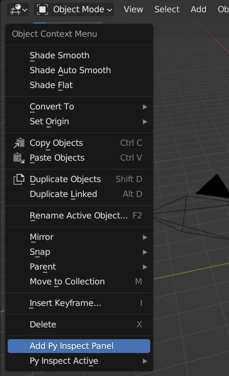
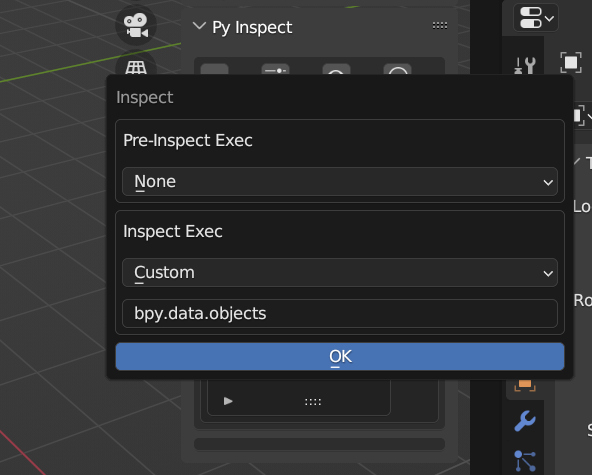
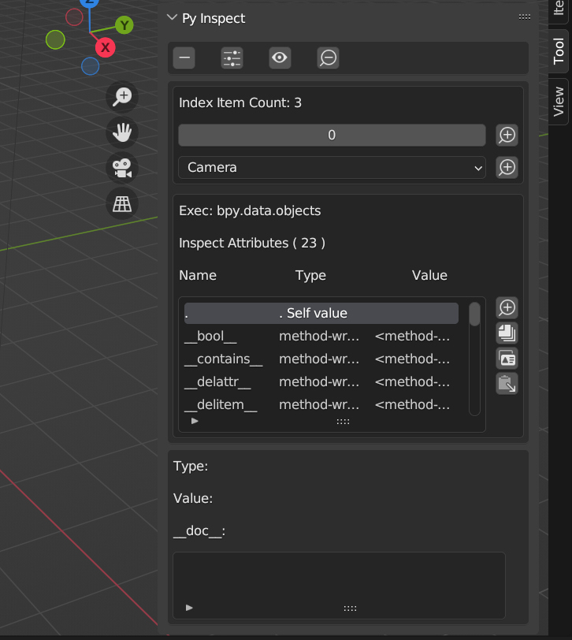
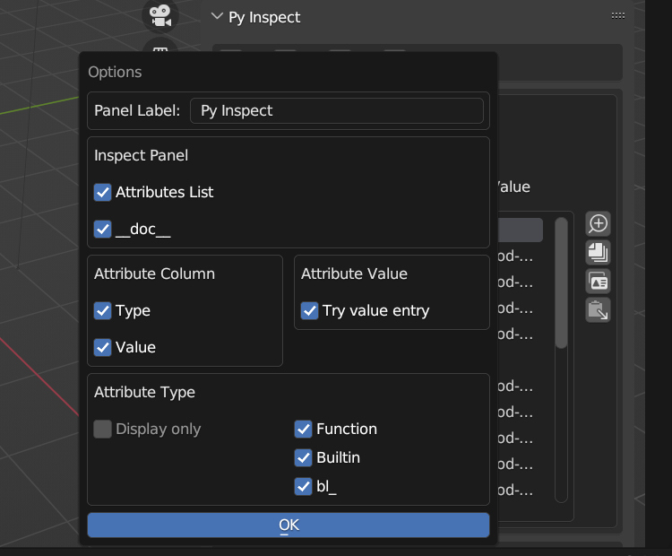
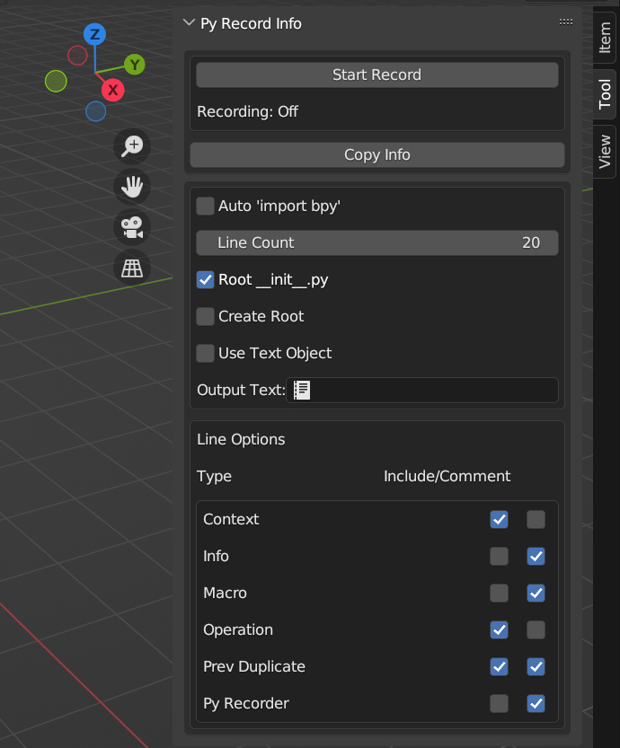
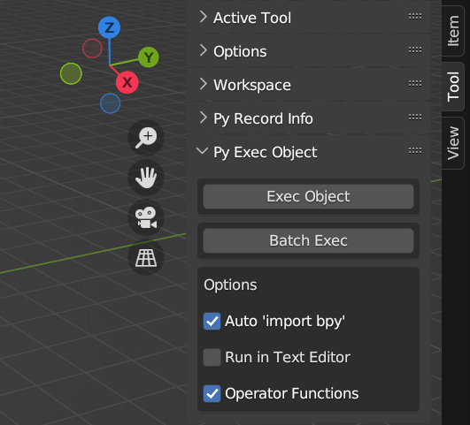
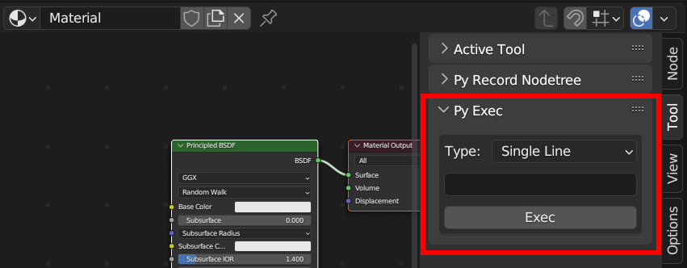
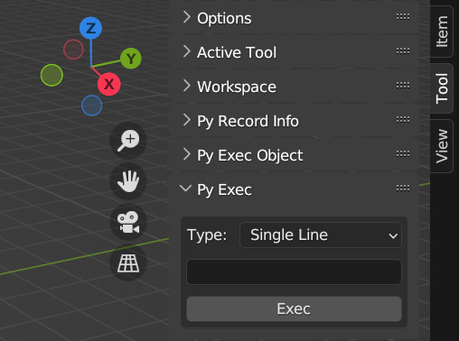
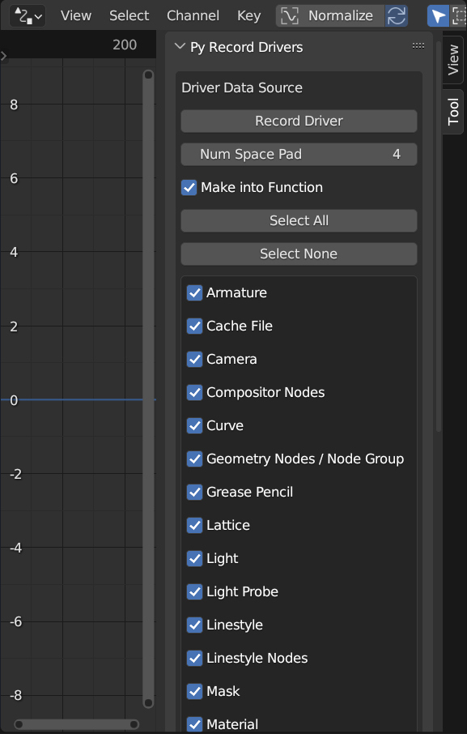

# Py Recorder: General Info

This documentation is a "Work In Progress" and not complete - yet.

## Add Py Inspect panel - Multiple Contexts

*Rick-click context menu -> Add Py Inspect Panel*

Function to add a Py Inspect panel to the current context's Tool menu, available in most contexts (e.g. View3D, Drivers Editor).

Right-click in a window to bring up the Context Menu, and near the bottom is 'Add Py Inspect Panel'.

Using this adds a Py Inspect panel to active context's Tool menu.

## Py Inspect Active - Multiple Contexts

Py Inspect Active is available in many contexts, e.g. View3D context:

Py Inspect Active in Node Editor context:

*Rick-click context menu -> Py Inspect Active -> type*

Select type of active thing to inspect, varies by context, e.g. active Object in View3D or active Node in Node Editor.

## Py Inspect - Multiple Contexts

Any Python 'thing' can be accessed in some way with Py Inspect. This includes, but is not limited to:
  - *values:*
    - e.g. run some code that calculates variable 'a', and inspect 'a'
  - *attributes:*
    - e.g. inspect string 'bpy.data.objects[0]', to view attributes of first Object in current file
  - *modules:*
    - e.g. pre-inspect string 'import mathutils', and inspect string 'mathutils', to view functions in the 'mathutils' module
  - *current Context:*
    - e.g. inspect string 'bpy.context.space_data', to view attributes specific to current area
      - e.g. 'space_data' in Node Editor context to get currently displayed NodeTree ('edit_tree')
	- enables viewing of values not available in Python Console / Text Editor context, e.g. currently displayed NodeTree

Py Inspect panel includes buttons at top for Remove Panel, Options, Inspect, and Zoom Out.

Below top row of buttons is Inspect Box:
  - Exec:
    - current string being used with 'exec()' to get Inspect Exec value
  - Inspect Attributes ( x )
    - x is total number of attributes of Inspect Exec value
  - Attributes List
    - attributes of Inspect Exec value, retrieved with 'dir()'

With buttons at side of Inspect Box:
  - Zoom In
    - inspect selected attribute, and update Inspect Box with new list of attributes
  - Advanced Copy Attribute(s)
    - show window with options to copy single/all attributes, including attribute type/__doc__
  - Copy from Selected Attribute
    - copy selected attribute to clipboard (same as Copy Full Path)
  - Paste to Selected Attribute
    - paste from clipboard to selected attribute, by reference, meaning:
      - code executed is of this form:  exec('selected_attribute = clipboard_value')
      - a reference is used, not a value
    - this may crash Blender, e.g. crash due to overflow:
      - reference to an array of Floating point values is 'pasted' to an array of Boolean value

## Py Inspect - Custom Py Inspect String

Choose options for code that is inspected:
  - *Pre-Inspect Exec* code is run first (if it exists), and does not need to return a value
  - *Inspect Exec* code is run second, and the output value is saved
  - 'dir()' command is used with output value, to get attributes list for Inspect Box
  - to view output value, choose the period symbol '.' in attributes list of Inspect Box
  - see bottom of Inspect Box to view value of selected attribute (may need to scroll down)
  - value info, including 'type' and '__doc__', are below list of attributes

Pre-Inspect Exec can be one line, or entire Text (see Text Editor).
  - e.g. 'import datetime'
    - set Inspect Exect string to 'datetime', to easily inspect the 'datetime' module to find functions, constants, etc.

Inspect Exec is the string that will be executed, and the result value inspected.
  - e.g. 'bpy.data.objects'

Press OK button to set Inspect Exec string and update this Py Inspect panel (including attributes list).

## Py Inspect - Example with 'bpy.data.objects'

Drill down to indexed inspect values with Zoom Plus icons for either integer indexing, or string indexing, or both.

Drill down to specific attributes in the Inspect Attributes list with Zoom Plus icon to the right of the list.

Copy single/all attributes in Inspect Attributes list to clipboard/Text.

Copy reference of active item in Attributes List to clipboard.

Paste clipboard reference value to active item in Attributes List
  - WARNING: Save work, if needed, before using this function - using this may crash Blender!
  - crashes happen immediately, or Blender freezes a moment and then crashes
  - likely an overflow error, e.g. can be caused by copying Integer array to Boolean array

## Py Inspect Options - Multiple Contexts

Change which data is displayed in Py Inspect panel, or change name of Panel, etc.

## Py Record Info - View3D Context

Filter and copy lines from Info context (e.g. lines of Python code that create Cube mesh, Light, Landscape).
  - lines can be copied to Text (see Text Editor), or Text Object (see View3D)
  - line type filters are available near bottom of panel

If 'Root __init__.py' is enabled, then active Object will be given a reference to the Text / Text Object created.
  - active Object can 'run' later
  - e.g. record values used to create Object, like wall from 'Wall Factory' add-on
    - some things are hard to re-create because the values are forgotten, not saved as presets
    - save Info lines to Text for re-creating Object the exact same way

## Py Exec Object - View3D Context

Single Objects can be 'run' with 'Exec Object' button.
  - 'Operator functions' (invoke, draw, execute) will be run, if enabled, to e.g.
    - show user a popup input window, to adjust input values before actually 'running' the Object
  - 'Operator functions' are not run if code is run in Text Editor (run as script)

Multiple Objects can be run with one click by using the 'Batch Exec' button.
  - some 'Operator functions' are not run (only 'execute' is run) when 'Batch Exec' is used
  - use to quickly run many Objects in a scene

## Py Exec - Multiple Contexts

Execute code in any context. Can be single line or lines of Text (see Text Editor).

Result is not inspected, and does not affect Py Inspect panels.

## Py Record Drivers - Drivers Editor Context

Convert Drivers to Python Text, available in Text Editor.

List of types of Drivers to convert is given, to allow filtering which drivers will be converted to code.

## Py Record Nodetree - Node Editor Context

Convert entire Nodetree to Python Text, available in Text Editor. Works with all builtin types of Blender nodetrees:
  - Shader Nodes
  - Geometry Nodes
  - Compositor Nodes
  - World Nodes (environment nodes, e.g. HDRI background image)
  - Linestyle Nodes
  - Texture Nodes

### Work In Progress Note

Blender has *hundreds*, if not *thousands*, of different node types/variations. Not all types of nodes have been tested, so...

This add-on might not work with all node types/variations.

If errors do occur, report it (on this GitHub Issues page) and the author will try to resolve the issue.
