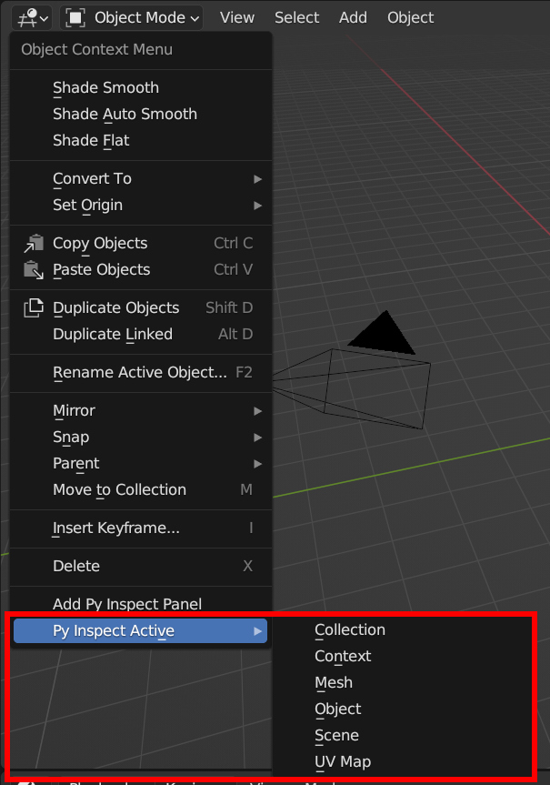
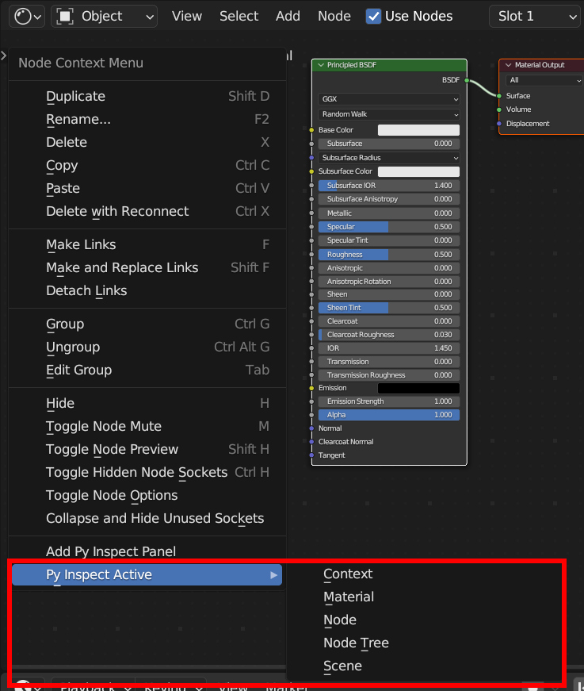
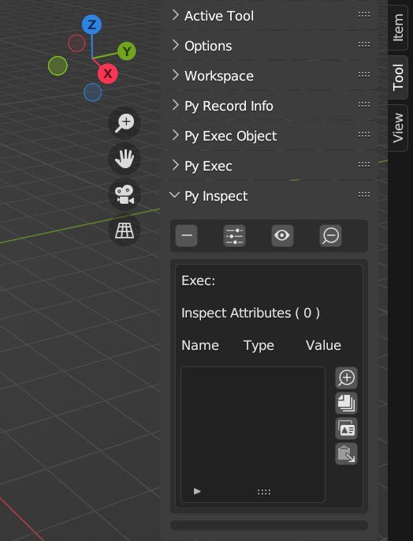
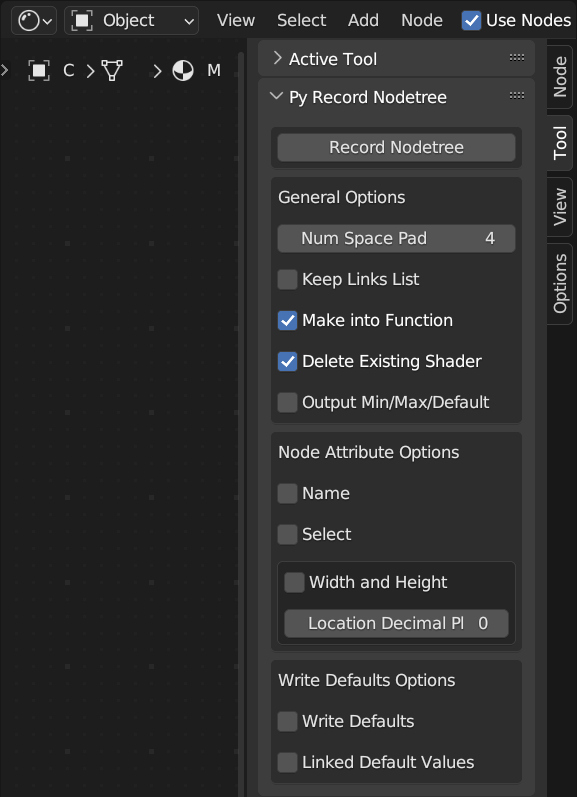

# Py Recorder: General Info

This documentation is a "Work In Progress" and not complete - yet.

## Add Py Inspect panel - Multiple Contexts

*Rick-click context menu -> Add Py Inspect Panel*

Function to add a Py Inspect panel to the current context's Tool menu, available in most contexts (e.g. View3D, Drivers Editor).

Right-click in a window to bring up the Context Menu, and near the bottom is "Add Py Inspect Panel".

Using this adds a Py Inspect panel to active context's Tool menu.

## Py Inspect Active - Multiple Contexts

Py Inspect Active is available in many contexts, e.g. View3D, Node Editor:

*Rick-click context menu -> Py Inspect Active -> type*

Select type of active thing to inspect, varies by context, e.g. active Object in View3D, active Node in Node Editor.

## Py Inspect - Multiple Contexts

## Py Inspect - Custom Py Inspect String

Pre-Inspect Exec can be one line, or entire Text (see Text Editor).
  - e.g. "import datetime"
    - set Inspect Exect string to "datetime", to easily inspect the "datetime" module
	- to find functions, constants, etc.

Inspect Exec is the string that will be executed, and the result value inspected.
  -e.g. "bpy.data.objects"

Press OK button to set Inspect Exec string and update this Py Inspect panel (including attributes list).

## Py Inspect - Example with "bpy.data.objects"

Drill down to indexed inspect values with Zoom Plus icons for either integer indexing, or string indexing, or both.

Drill down to specific attributes in the Inspect Attributes list with Zoom Plus icon to the right of the list.

Copy single/all attributes in Inspect Attributes list to clipboard/Text.

Copy reference of active item in Attributes List to clipboard.

Paste clipboard reference value to active item in Attributes List
  - WARNING: Save work, if needed, before using this function - using this may crash Blender!
  - crashes happen immediately, or Blender freezes a moment and then crashes
  - likely an overflow error, e.g. can be caused by copying Integer array to Boolean array

## Py Inspect Options - Multiple Contexts

Change which data is displayed in Py Inspect panel, or change name of Panel, etc.

## Py Record Info - View3D Context

Filter and copy lines from Info context (e.g. lines of Python code that create Cube mesh, Light, Landscape).
  - lines can be copied to Text (see Text Editor), or Text Object (see View3D)
  - line type filters are available near bottom of panel
If "Root __init__.py" is enabled, then active Object will be given a reference to the Text / Text Object created.
  - active Object can "run" later
  - e.g. record values used to create Object, like wall from "Wall Factory" add-on
    - some things are hard to re-create because the values are forgotten, not saved as presets
	- save Info lines to Text for re-creating Object the exact same way

## Py Exec Object - View3D Context

Single Objects can be "run" with "Exec Object" button.
  - "Operator functions" (invoke, draw, execute) will be run, if enabled, to e.g.
    - show user a popup input window, to adjust input values before actually "running" the Object
  - "Operator functions" are not run if code is run in Text Editor (run as script)

Multiple Objects can be run with one click by using the "Batch Exec" button.
  - some "Operator functions" are not run (only "execute" is run) when "Batch Exec" is used
  - use to quickly run many Objects in a scene

## Py Exec - Multiple Contexts

Execute code in any context. Can be single line or lines of Text (see Text Editor).

## Py Record Drivers - Drivers Editor Context

Convert Drivers to Python Text, available in Text Editor.

## Py Record Nodetree - Node Editor Context

Convert entire Nodetree to Python Text, available in Text Editor. Works with all builtin types of Blender nodetrees:
  - Shader Nodes
  - Geometry Nodes
  - Compositor Nodes
  - World Nodes (environment nodes, e.g. HDRI background image)
  - Linestyle Nodes
  - Texture Nodes

### Work In Progress Note

Blender has *hundreds*, if not *thousands*, of different node types/variations. Not all types of nodes have been tested, so...

This add-on might not work with all node types/variations.

If errors do occur, report it (on this GitHub Issues page) and the author will try to resolve the issue.
